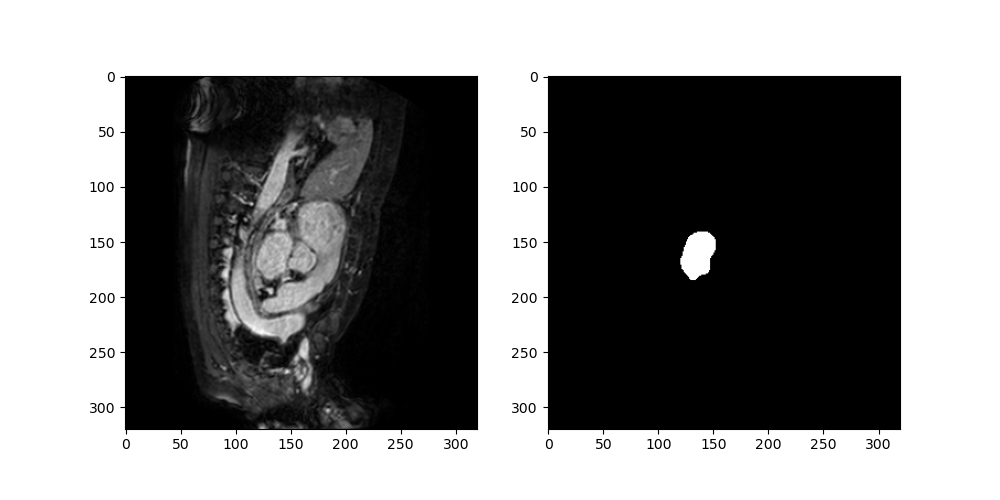

# Homework 10: Heart MRI Segmentation using Deep Learning

In this homework, we will solve a medical image segmentation problem using deep learning. 
The objective is to build a model that can automatically segment the left atrium from 3D MRI images of the heart.

The dataset is from the Medical Decathlon challenge and contains 20 MRI images for training and 10 for testing. Each image is in NIfTI format and includes both the MRI scan and the corresponding left atrium segmentation mask.
The dataset is part of the Medical Segmentation Decathlon challenge, which can be found at: http://medicaldecathlon.com/


Example images from the dataset:



Specific objectives for this homework are:
1. Practice working with 3D medical image datasets
2. Implement a 3D CNN architecture for segmentation
3. Use TensorBoard to monitor and analyze training
4. Evaluate model performance with appropriate metrics

### Submission Requirements
- All source code files
- Single report file in markdown format with the following sections:
    - Dataset Access and Loading (explain how you loaded and preprocessed the 3D data) (10 pts)
    - Model Architecture (explain your 3D model architecture and show your computational graph using TensorBoard) (10 pts)
    - Training Implementation (explain your training implementation and show your training and validation Dice loss curves using TensorBoard) (10 pts)
    - Model Evaluation (explain your model evaluation and show example segmentation results on validation cases) (10 pts)
- TensorBoard logs (only for the best performing model)

## Dataset Access and Loading
The Heart MRI dataset can be accessed from the Medical Decathlon challenge. The dataset has already been downloaded and saved in the following directory:

```python
data_dir = "/home/osz09/DATA_SharedClasses/SharedDatasets/MedicalDecathlon/Task02_Heart"
```

### Dataset Exploration 
Create a file called `analyze_data.py` that:
- Loads the Heart MRI dataset from the NIfTI files
- Displays basic statistics (number of images, image dimensions, voxel spacing)
- Visualizes sample slices from different orientations (axial, sagittal, coronal)
- (Optional) Shows the distribution of segmentation volumes

### Model Architecture 
Design and implement a 3D CNN in `mymodel.py` that includes:
- 3D convolutional layers with appropriate kernel sizes
- 3D batch normalization layers
- 3D max pooling layers
- 3D upsampling / transposed convolutional or other upsampling layers
- Skip connections (recommended for U-Net style architectures)

Your model description should include:
- Summary of the model architecture (in your own words)
- Number of parameters
- Visual representation of the model using tensorboard

### Training Implementation 
Create a `training.py` script that implements:
- Training loop with batches and epochs
- Validation after each epoch
- [Dice loss calculation](https://arxiv.org/abs/1707.03237) (see Section 3.1 for details)
- Early stopping (optional)
- Learning rate scheduling (optional)

TensorBoard logging should include:
- Training and validation Dice loss curves
- Model computational graph
- Example segmentation predictions (optional)
- Memory usage statistics (optional)

### Model Evaluation 
In your main script (`main.py`), implement:
- Model training
- Performance evaluation on validation set
- 3D visualization of results
- Calculation of Dice scores and other relevant metrics

### Suggested Data Preprocessing
- Resample images to isotropic spacing (I believe they are already isotropic)
- Crop or pad to consistent dimensions (I believe they are already consistent)
- Normalize intensities (zero mean, unit variance) (I believe they are already normalized)
- Data augmentation (optional):
  - Random rotations
  - Random intensity variations
  - Random crops
